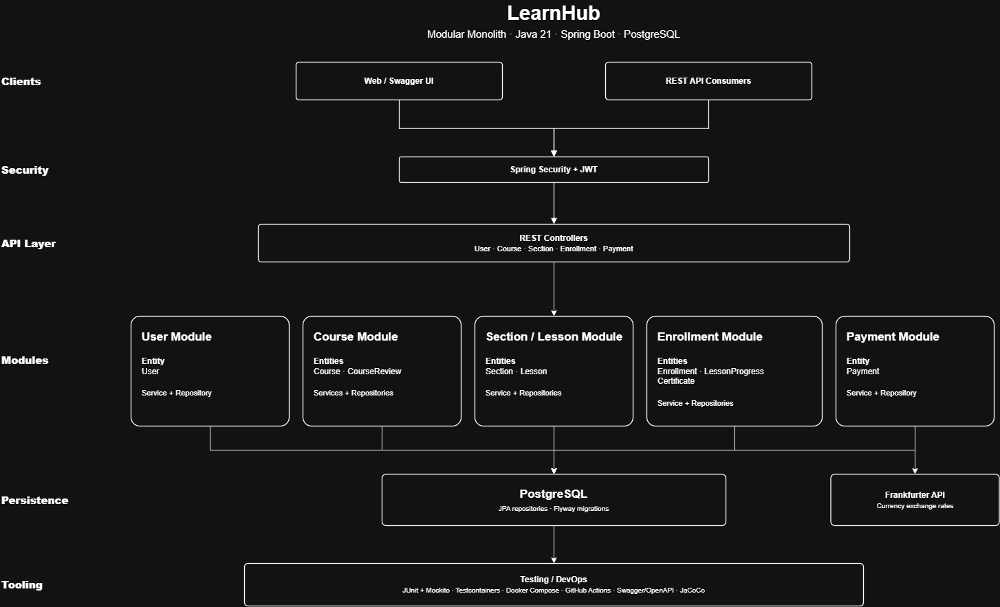

# LearnHub API

LearnHub is a REST API for an online course platform, built as a portfolio project focused on backend architecture,
authentication, relational data modeling, course access control, payments, progress tracking, and external API
integration.

Live API and interactive documentation: https://learnhub-8zwy.onrender.com/swagger-ui/index.html

Note: the application is hosted on Render's free tier, so the first request after a period of inactivity can take up to
a minute while the instance starts.

## Overview

LearnHub is implemented as a modular monolith. The application is deployed as a single Spring Boot service and uses one
PostgreSQL database, while the codebase is separated into domain-focused modules for users, courses, sections and
lessons, enrollments, and payments.

Modules communicate across domain boundaries through gateway interfaces. Each module keeps ownership of its own
services, repositories, entities, and persistence logic. The same gateway abstraction is also used for the Frankfurter
currency exchange integration.

## Features

- User registration and login with JWT-based authentication
- Role-based authorization with USER, CREATOR, and ADMIN roles
- Course creation, updates, visibility management, search, pagination, and sorting
- Course sections and lessons with access control
- Course reviews with ratings and comments
- Course purchases with automatic enrollment
- Multi-currency purchases using exchange rates from the Frankfurter API
- Payment history with date filtering and pagination
- Enrollment and lesson progress tracking
- Certificate generation after course completion
- Centralized exception handling and request validation
- Swagger/OpenAPI documentation
- Docker Compose configuration for local execution
- Continuous integration with GitHub Actions

## Architecture

The project follows a domain-oriented modular monolith structure. Controllers expose the REST API, services contain
application and business logic, repositories handle persistence, and gateway interfaces define cross-module boundaries.

Repositories access PostgreSQL directly through Spring Data JPA. Gateways are used when one module needs functionality
or information owned by another module. The payment module also uses a CurrencyExchangeGateway backed by an OpenFeign
client for the Frankfurter API.



Main packages:

```text
org.example.learnhub
├── user
├── course  
├── section
├── enrollment
├── payment
├── gateway
├── integration
├── config
└── exception
```

## Tech stack

- Java 21
- Spring Boot 4
- Spring Security
- Spring Data JPA
- Spring Validation
- PostgreSQL
- Flyway
- Auth0 java-jwt
- Spring Cloud OpenFeign
- Frankfurter currency exchange API
- springdoc-openapi / Swagger UI
- JUnit
- Mockito
- Testcontainers
- JaCoCo
- Docker and Docker Compose
- GitHub Actions
- Render

## API documentation

Swagger UI is available at:

```text
/swagger-ui/index.html
```

The raw OpenAPI specification is available at:

```text
/v3/api-docs
```

### Main resources

| Resource                                        | Description                                           |
|-------------------------------------------------|-------------------------------------------------------|
| `/api/users/register`                           | User registration                                     |
| `/api/users/login`                              | User authentication                                   |
| `/api/users/me`                                 | Authenticated user profile                            |
| `/api/courses`                                  | Creator course management                             |
| `/api/courses/search`                           | Course search with filtering, pagination, and sorting |
| `/api/courses/{courseId}`                       | Course details and updates                            |
| `/api/courses/{courseId}/sections`              | Course section creation and listing                   |
| `/api/sections/{sectionId}/lessons`             | Lesson creation and listing                           |
| `/api/sections/lessons/{lessonId}`              | Lesson details                                        |
| `/api/courses/{courseId}/reviews`               | Course reviews                                        |
| `/api/payments`                                 | Payment history                                       |
| `/api/payments/{courseId}`                      | Course purchase                                       |
| `/api/enrollments`                              | User enrollments                                      |
| `/api/enrollments/lessons/{lessonId}/start`     | Start lesson progress                                 |
| `/api/enrollments/lessons/{lessonId}/progress`  | Update lesson progress                                |
| `/api/enrollments/{enrollmentId}/certificates`  | Generate a completion certificate                     |
| `/api/enrollments/certificates/{certificateId}` | Retrieve a certificate                                |

Registration, login, Swagger UI, and the OpenAPI specification are publicly accessible. Other application endpoints
require a valid JWT sent as a Bearer token in the Authorization header.

## Running locally

### With Docker

The project includes a `docker-compose.yml` that starts the API and PostgreSQL. The backend uses the published Docker
image `brunobaldiga/learnhub`.

```bash
git clone https://github.com/brunobaldiga/learnhub.git
cd learnhub
docker compose up
```

The API will be available at:

```text
http://localhost:8080
```

Swagger UI will be available at:

```text
http://localhost:8080/swagger-ui/index.html
```

### From source

Prerequisites:

- Java 21
- Maven or the included Maven wrapper
- PostgreSQL

Clone the repository:

```bash
git clone https://github.com/brunobaldiga/learnhub.git
cd learnhub
```

Create a PostgreSQL database and configure the application using environment variables:

```text
DB_URL=jdbc:postgresql://localhost:5432/learnhub
DB_USER=your_db_user
DB_PASSWORD=your_db_password
JWT_SECRET=your_jwt_secret
```

The Frankfurter API URL can also be overridden if needed:

```text
FRANKFURTER_URL=https://api.frankfurter.dev
```

Run the application:

```bash
./mvnw spring-boot:run
```

Flyway runs the database migration automatically during startup, and Hibernate validates the resulting schema against
the JPA mappings.

## Testing

The project contains unit, controller, service, gateway, repository, and integration tests. PostgreSQL repository tests
use Testcontainers to run against a real PostgreSQL instance.

The current test suite contains 186 tests, with no failures or errors in the latest included test reports.

Run the test suite with:

```bash
./mvnw clean test
```

JaCoCo generates the coverage report at:

```text
target/site/jacoco/index.html
```

GitHub Actions runs the Maven test workflow in CI.

## Contact

Bruno
brunobaldiga@gmail.com
